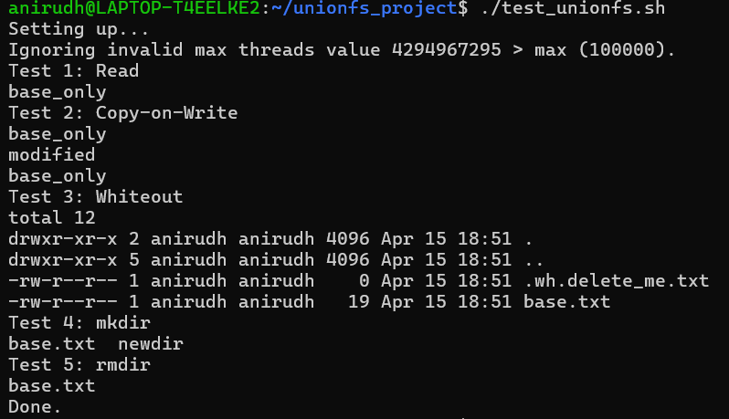

# Mini-UnionFS (FUSE-Based Union File System)


---

## 📌 Overview

Mini-UnionFS is a simplified implementation of a **Union File System** using **FUSE (Filesystem in Userspace)** in C.

It combines a **read-only lower directory** and a **read-write upper directory** into a single unified filesystem view. This project helps in understanding how layered storage works internally in systems like Docker.

---

## 🚀 Features

* Layered filesystem (lower + upper → merged view)
* Copy-on-Write (CoW)
* Whiteout mechanism for deletion
* POSIX operations:

  * `getattr`, `readdir`, `open`
  * `read`, `write`, `create`, `unlink`
  * `mkdir`, `rmdir`
* Runs in user space using FUSE
* Automated test script included

---

## 🏗️ Architecture

```
           +------------------+
           |    lower_dir     |  (Read-only layer)
           +------------------+
                    ↓
           +------------------+
           |    upper_dir     |  (Writable layer)
           +------------------+
                    ↓
           +------------------+
           |       FUSE       |
           +------------------+
                    ↓
           +------------------+
           |   mount (mnt)    |  (Unified view)
           +------------------+
```

### 📌 File Resolution Priority

```
whiteout (.wh.*) > upper_dir > lower_dir
```

---

## 🧠 Core Concepts

### 🔹 Copy-on-Write (CoW)

When a file from the lower layer is modified:

1. It is copied to the upper layer
2. The modification happens on the copied file

This ensures the original file remains unchanged.

---

### 🔹 Whiteout Mechanism

When deleting a file from the lower layer:

* A hidden file `.wh.<filename>` is created in the upper directory

This prevents the file from appearing in the merged view without removing it from the lower layer.

---

## ⚙️ Requirements

* Ubuntu / WSL (recommended)
* GCC
* FUSE3

```bash
sudo apt update
sudo apt install -y build-essential fuse3 libfuse3-dev
```

---

## 🔧 Build

```bash
make
```

or

```bash
gcc mini_unionfs.c -o mini_unionfs -lfuse3
```

---

## ▶️ Manual Execution

### Terminal 1:

```bash
mkdir lower upper mnt
echo "base_only_content" > lower/base.txt
echo "to_be_deleted" > lower/delete_me.txt

./mini_unionfs lower upper mnt
```

---

### Terminal 2:

```bash
cd mnt
ls
cat base.txt
```

---

## 🧪 Run Automated Tests

```bash
chmod +x test_unionfs.sh
./test_unionfs.sh
```

---

## 📸 Sample Output

The following output demonstrates:

* Copy-on-Write behavior
* Whiteout file creation
* Directory operations



---

## ✅ Expected Behavior

### ✔ Copy-on-Write

* Lower layer remains unchanged
* Upper layer reflects modifications

---

### ✔ Whiteout

```bash
ls -la upper
```

Output includes:

```
.wh.delete_me.txt
```

---

### ✔ Directory Operations

* `mkdir` → creates in upper layer
* `rmdir` → removes correctly

---

## ⚠️ Important Notes

* Run only inside:

  ```
  /home/<username>/
  ```

  (FUSE does not work inside `/mnt/...` in WSL)

* Use two terminals for manual testing

* Do not interrupt the filesystem while running

---

## 📚 Applications

* Container storage systems (Docker)
* Overlay filesystems
* Virtualized environments

---

## 🏁 Conclusion

This project demonstrates:

* Layered filesystem design
* Copy-on-Write mechanism
* Whiteout-based file masking
* Practical use of FUSE in user-space filesystem development

---

Developed as part of a Cloud Computing project
